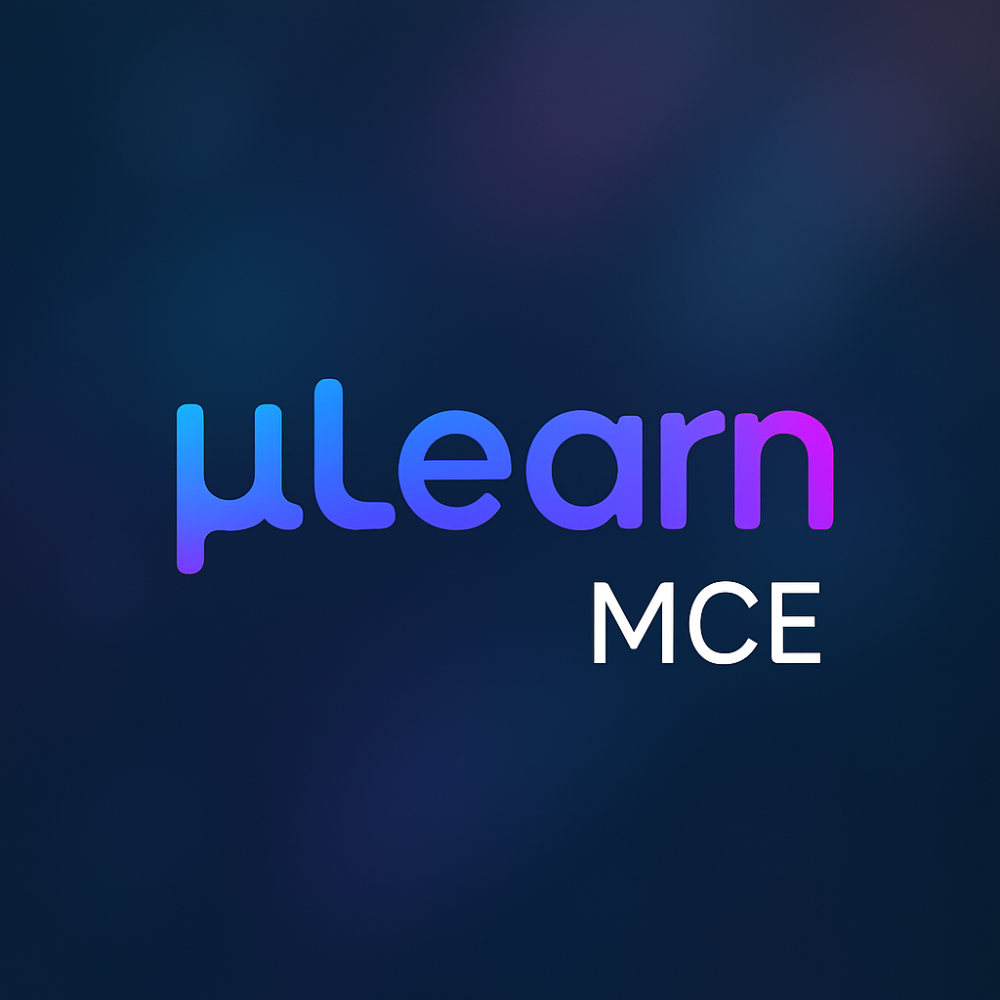

  
  
  # 🚀 Mulearn MCE
  ### *Empowering Innovation at Marian Engineering College*
  
  

    
  

---

## 🌟 About Us

<!--  -->

Welcome to **Mulearn MCE** - the tech club of **Marian Engineering College**! We are a vibrant community of passionate students, innovators, and tech enthusiasts who believe in the power of technology to transform the world.

Our mission is to:

- 🎯 Foster innovation and creativity
- 🤝 Build a collaborative tech community
- 📚 Provide hands-on learning experiences
- 🚀 Bridge the gap between academia and industry

 

---

<!--
## 🎨 What We Do

| 💻 **Development** | 🤖 **AI/ML** | 🌐 **Web Tech** | 📱 **Mobile** |
|:---:|:---:|:---:|:---:|
| Full-stack projects | Machine Learning workshops | React & Node.js | Flutter & React Native |
| Open source contributions | Data Science bootcamps | Progressive Web Apps | Cross-platform development |

### 🔥 Our Activities

🎪 <strong>Tech Events & Workshops</strong>

 

- **Hackathons** - 48-hour coding marathons
- **Tech Talks** - Industry expert sessions
- **Coding Bootcamps** - Intensive learning program

🏆 <strong>Competitions & Challenges</strong>

 

🤝 <strong>Community Building</strong>

 

---

## 📊 GitHub Stats

  
  

  

---

---

## 🎯 Featured Projects

---

## 📅 Upcoming Events

|   📅 Date    |       🎯 Event       |    📍 Venue     |            🔗 Registration            |
| :----------: | :------------------: | :-------------: | :-----------------------------------: |
| Jul 15, 2025 | **-* | -| [Register](https://forms.gle/example) |
| Jul 20, 2025 |   **-**    |     -      | [Register](https://forms.gle/example) |
| Aug 10, 2025 | **-** |     IT Lab      | [Register](https://forms.gle/example) |

--- -->

## 🌐 Connect With Us

  

---

<!-- ## 👥 Leadership Team

| Role | Name | Contact |
|:---:|:---:|:---:|
| 🎯 **Lead** | [Your Name] |  |
| 💻 **Tech Lead** | [Tech Lead] |  |
| 🎨 **Creative Lead** | [Creative Head] |  |

--- -->

## 🤝 Contributing

We love contributions! Whether you're a student at MCE or from another college, you're welcome to contribute to our projects.

📋 <strong>How to Contribute</strong>

 

1. 🍴 **Fork** the repository
2. 🌟 **Create** a feature branch (`git checkout -b feature/AmazingFeature`)
3. 💫 **Commit** your changes (`git commit -m 'Add some AmazingFeature'`)
4. 🚀 **Push** to the branch (`git push origin feature/AmazingFeature`)
5. 🔄 **Open** a Pull Request

## 📧 Contact Us

**📍 Address:** Marian Engineering College, Trivandrum, Kerala  
**✉️ Email:** mulearnmce@gmail.com

---

  
### ⭐ Star our repositories if you find them helpful!

**Made with ❤️ by Mulearn MCE Tech Team**

🔍 Seeking passionate contributors and collaborators!

